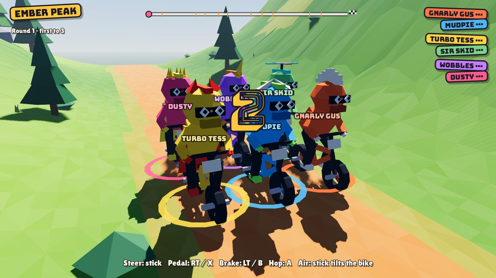
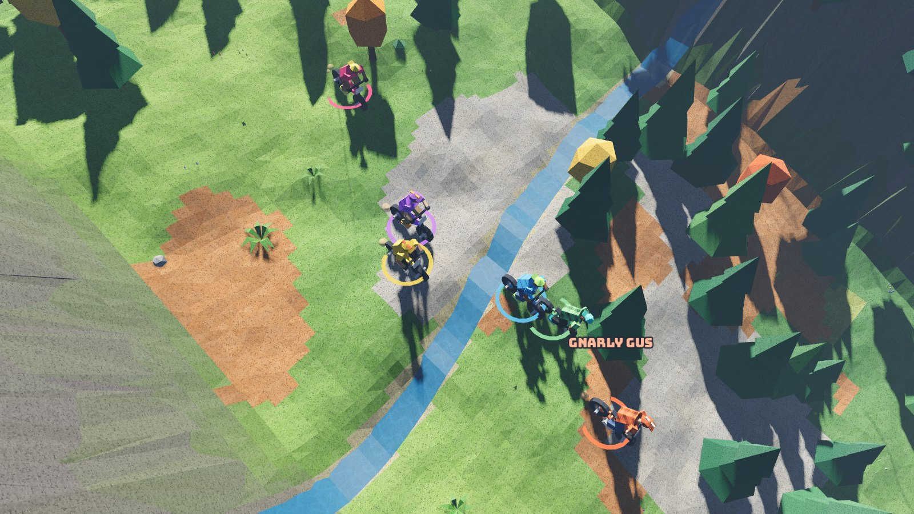
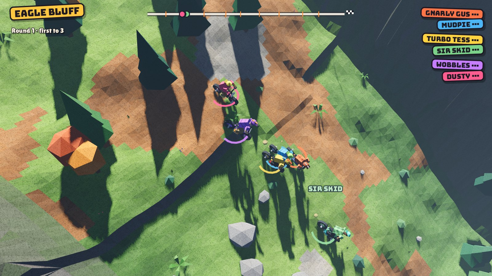
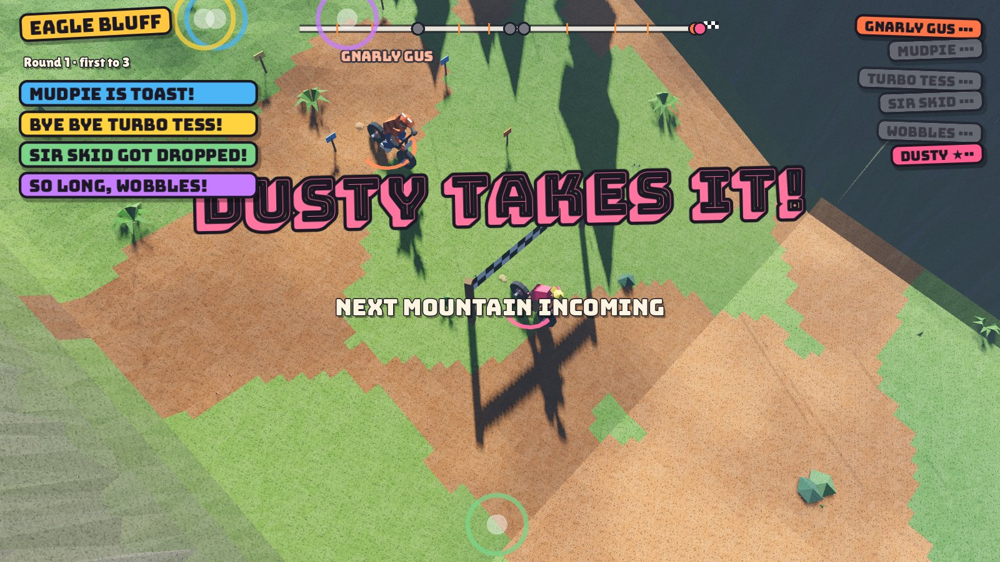

# Downhill Rush

A top-down BMX downhill survival race for GameNight: everyone rides the same
procedurally generated mountain on one shared screen, seen from above with
downhill always running to the bottom right. The leader rides near that corner
and sees the least of what's coming; the camera follows them and never waits. Fall behind, crash once too often or take the scenic route and
you drop off the bottom of the screen: you're out. Last rider standing, or
first through the finish gate, takes the round. First to three rounds wins.

Godot 4.5, GL Compatibility renderer, 1 to 8 riders. Everything is built from
code at runtime: low-poly terrain, trees, rocks and riders, with no imported
models. Each rider has a ring in their colour on the
ground under them, which also shows where they will land mid-air.

Riders are ordinary 90s BMX kids in flannel, striped or plain shirts, jeans
and sneakers, with a lid or a backwards cap. Clothes, dirt and rock carry small
greyscale textures painted in code (`src/textures.gd`) and sampled without
filtering, so they read as chunky texels on the low-poly shapes.





| | |
|---|---|
|  |  |

## Play

```sh
godot --path downhill-rush            # join screen
godot --path downhill-rush -- --demo  # six bots, no input needed
```

Pads: left stick steers, **A** hops, **RT / X** pedals, **LT / B** brakes. In
the air, push the stick forward to drop the nose and pull back to lift it.
Keyboard riders use WASD + Space or the arrow keys + Enter. On the join
screen, press A (Space, Enter) to join; the first rider presses A again to
start. B toggles bots, which fill the field up to four riders. Escape pauses.

## How a mountain works

There is no trail. `src/course.gd` builds a steep, rough mountainside and you
pick your own line down it. The slope is broken up by cliff bands: above each
one the ground eases into a shelf, then drops off a ledge. Small ledges can be
ridden; big ones will put you on your face, unless you find one of the few
chutes where the ledge becomes a steep ramp. Between the bands there are forest
clumps, boulder fields, loose scree with little grip, and streams that bog you
down. Valley walls on either side keep the field together.

Bike physics (`src/bike.gd`) runs on the same analytic height function the
terrain mesh is built from, so every roll, ledge and hollow behaves the way it
looks. Gravity is strong on these pitches, so most of the riding is braking:
tyres have limited grip that depends on the ground (`Bike.GRIP`,
`Course.grip`); ask for more and you slide, and hold a big slide and you wash
out. Side slopes keep pulling you down the fall line. Landings are judged by
how steeply you hit the ground and how far the bike's pitch is from it. Riding
into a tree or boulder fast is a crash; slowly, you glance off it. Riders are
solid and shove each other around; a hard hit can take someone down.

Bots (`src/bot.gd`) read the slope ahead: they score a fan of lines for
ledges, trees and boulders, head for a chute when a big cliff comes up, and
brake for whatever their line throws at them.

## GameNight

The [GameNight Godot addon](https://github.com/ontola/gamenight/tree/main/sdk/godot)
is vendored in `addons/gamenight` (from gamenight `ba2cce0`). Under a GameNight
host the game:

- reads each seat's input with `GameNight.frame_for_seat` and plays `ai` seats
  as bots; empty seats get no rider;
- sends `participation` (`instant_join: false`) and `ready` after building
  the first mountain;
- starts the countdown on `start`, freezes on `pause`, reports every finished
  round with `notify_finished`, then keeps running its own next round and match;
- picks up name changes from `party_updated` without resetting the match;
- declares two settings: rounds to win (1 to 9) and mountain length
  (short, medium, long; applies from the next mountain).

`gamenight.json` is a draft catalog entry. It has no download yet.

## Checks

```sh
godot --headless --path downhill-rush --script tests/course_check.gd  # cliff bands all have a way down
godot --headless --path downhill-rush --script tests/ride_check.gd    # crashes and times per strategy
python3 downhill-rush/tests/lifecycle.py --godot godot               # managed launch against a fake host
tools/shot.sh out.png --demo --skip=30                               # screenshot via xvfb
```

`--skip=N` fast-forwards the race by N seconds, `--seed=N` fixes the mountain,
`--shot-phase=join|countdown|race|round_over` and `--shot-air` pick the moment.
`--showcase` points a close camera at the start grid to show off the riders,
and `--no-hud` hides the HUD.

## Not yet

No sound, no packaged release or catalog download, and the feel has only been
tuned against bots and simulations, not real controllers.

## License

See the repository license. The GameNight addon keeps its own license. The
fonts in `assets/fonts` (Bungee, Bungee Shade and Lilita One) are under the SIL
Open Font License; their license texts sit next to them.
